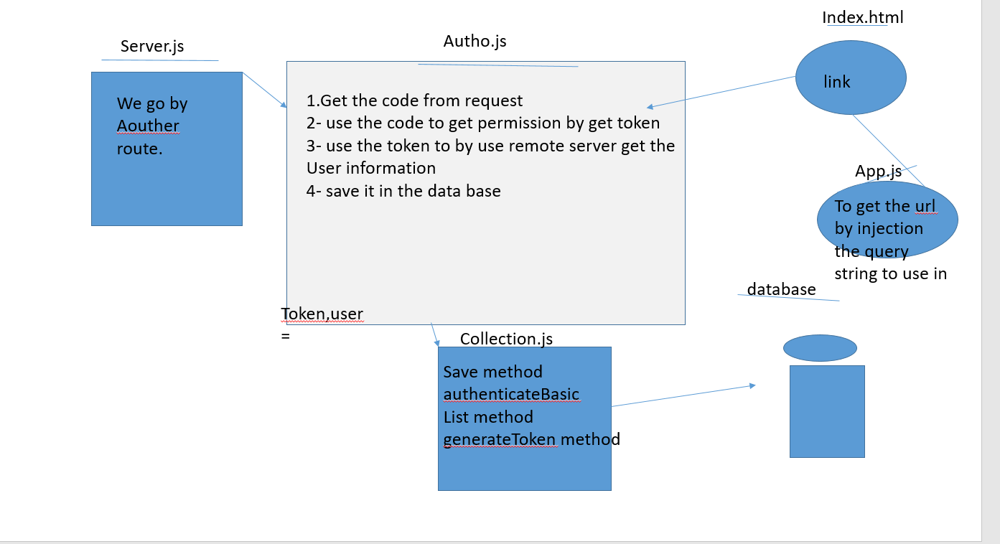

# Authentication

LAB - 12

Author: bayan alalem
ci/cd:[ci/cd ](https://github.com/bayan-97/Authentication/actions)
Setup
`.env `requirements
PORT - Port Number
`npm i -D jest ` `npm init -y` `npm i express` `npm i supertest` `npm i mongoose morgn cors` 

## detailes about files

### index.js
1- Require the mongoose library
 calling start() on my imported server module, it connect to Mongo, via mongoose
Prepare the server.js for modularization.

2- Require  router modules 
3- app.use() each them in your app so that your routes will respond
4- Write new routing modules for your server

### index.html

### routes.js

1- Create a router module for each of your data types
In each
2- Create an instance of express.Router() and export it

3 Move the appropriate route definitions and route handlers from server.js here

4- Redefine the definitions as route definitions 

## Begin the conversion from memory data to persistent data …
Import and initialize the appropriate Mongoose Collection (see bullet points below)
In your handler methods, rather than change your in-memory data store, call the appropriate model methods
Add Persistence with Mongoose Collections.

Work in lib/models/categories and lib/models/products

For each, create both a schema and collection file

user.schema.js and user.collection.js

#The schema file should define your data model as a Mongoose schema
The collection file should be a class that:
Imports the schema

Exports a class with CRUD methods, coded to work with your schema
read() performs a find() query in your schema
generateToken() to generate a Token following a valid login
authenticateBasic() o authenticate a user using the hashed password
save() we save a record Hash the plain text password given before you save a user to the database
## OAuth middleware
Exchange the code received on the initial request for a token from the Provider
Use the token to retrieve the user’s account information from the Provider
Create/Retrieve an account from our Mongo users database matching the user’s account (email or username) using the users model
Generate a token using the users model
Add the token and the user record to the request object.

**refactores our code**
## Running the app

`node index.js`

Endpoint:`/signup`

method:post
Returns token

`{`
`  "user": "john-api-server.demo.herokuapp.com",`
`  "password": "running",`
`  "
`}`
Endpoint:`/signin`
method:get
Returns:token and user

Endpoint:`/oauth`
method:get
Returns:token 

UML Diagram
